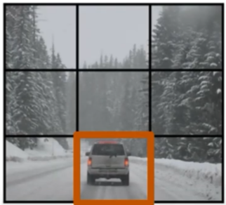
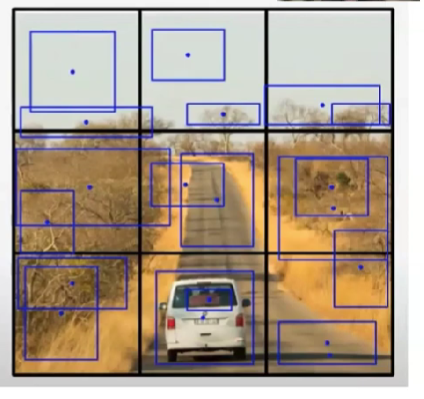
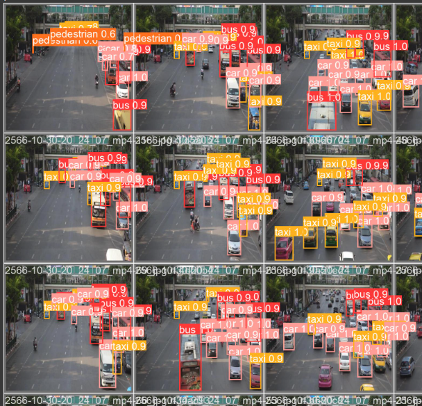
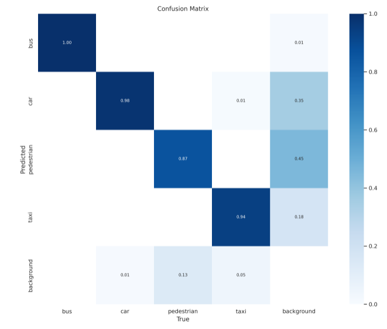

# Project Overview: AI-Driven Criminal Behavior Detection
# Train YOLOv8 Object Detection on Custom Dataset

This Jupyter notebook provides a comprehensive guide to training a YOLOv8 object detection model with a custom dataset. The key steps and code snippets are summarized below:

## Environment Setup
1. **Check NVIDIA GPU**: Ensuring the availability of a GPU for training.
2. **Setting Up Working Directory**: Establishing the current working directory.
3. **Installing Ultralytics Library**: Required for YOLOv8 training.

## Installation Alternatives
1. **Git Clone Method**: An alternative method for installing the Ultralytics library by cloning the GitHub repository.

## Object Detection Demonstration
1. **Importing YOLO from Ultralytics**: To use the YOLO model for object detection.
2. **Running a Test Detection**: Demonstrating the model's capability with a sample image.

## Key Code Snippets
1. **Environment Setup**
   ```python
   !nvidia-smi
   import os
   HOME = os.getcwd()
   print(HOME)
   !pip install ultralytics==8.0.20

## Introduction
This initiative focuses on the utilization of AI to identify criminal and abnormal activities. The benefits of this approach include:
- Simplified acquisition of evidence from diverse sources.
- Capability to alert nearby police stations, crucial in situations where victims cannot reach out to law enforcement.
- Effective monitoring and identification of various anomalies.

## Conceptual Framework
The core of this project revolves around processing camera feeds to discern anomalies. This involves:
- Analyzing both spatial aspects (location-based anomalies) and temporal dynamics (sequence of events).
- Utilizing a Generative Adversarial Network (GAN) model combined with supervised learning for anomaly detection.
- Implementing the YOLO (You Only Look Once) object detection model, known for its efficiency and various performance-optimized versions.

## YOLO Model Insights
YOLO, standing for "You Only Look Once," uniquely identifies bounding boxes and classifies objects in a single analysis of the image. The training methodology includes:
- Dividing the image into a grid system.
- Training the model to detect bounding boxes within each grid segment.
  
| Image Segmentation into Grid | Bounding Box Detection Training |
|------------------------------|---------------------------------|
|   | |

**Note:** The output size is n grid x n grid x (5 x bounding box/grid + number of classes).

The model then performs post-processing to consolidate overlapping bounding boxes and eliminates duplicates by applying confidence score thresholds.

### Objective Function Components
- **Localization Loss:** Uses Euclidean distance (Mean Squared Error) for position, size, and bounding box accuracy.
- **Classification Loss:** Applies Mean Squared Error for probabilities or binary cross-entropy.
- **Confidence Loss:** Managed through Mean Squared Error.

## Workshop and Results
During a recent workshop, I annotated 100 images from a video available [here](https://app.roboflow.com/ds/8iISTGAJ0P?key=9s7qZp3oqr). The training yielded promising results:



## Real-World Application Considerations
Deploying this model effectively requires budgetary considerations:
- For setups with high-performance GPUs, a centralized operation with a single API gateway for multiple cameras is feasible.
- In case of performance bottlenecks, employing cloud computing for load balancing and segmenting camera feeds may be necessary to maintain efficiency.
