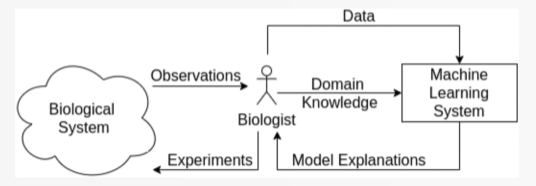
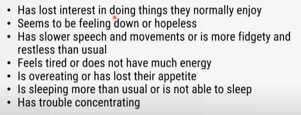
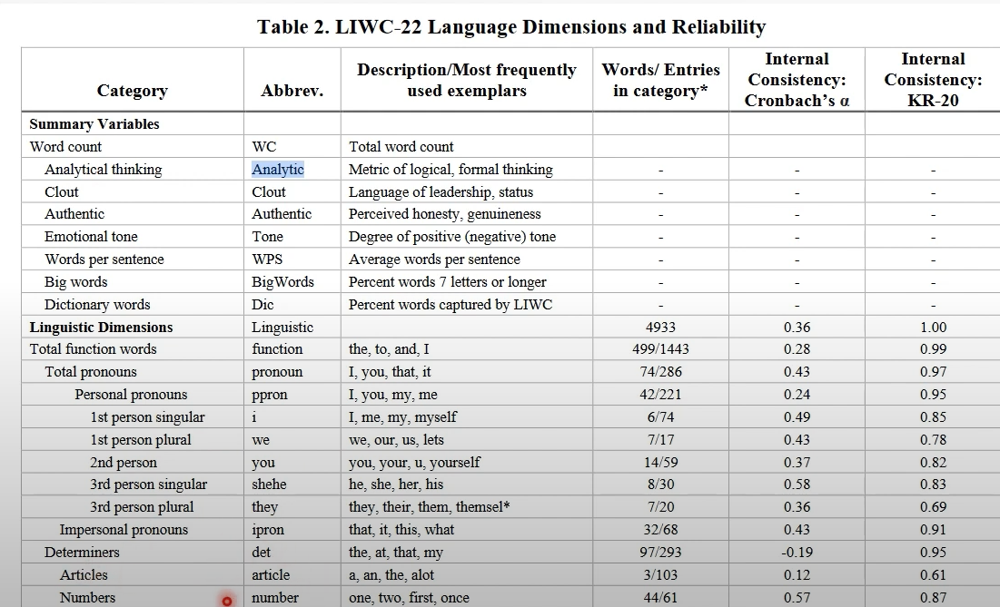
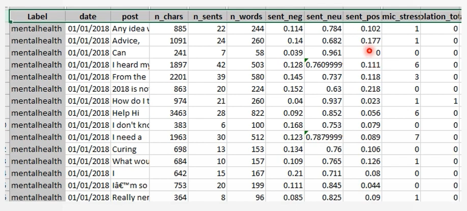
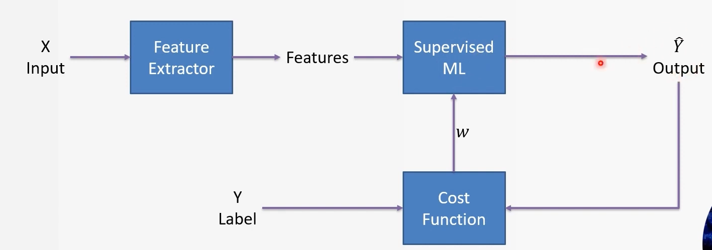
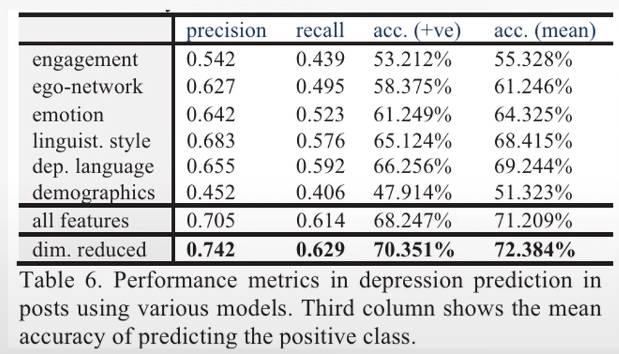
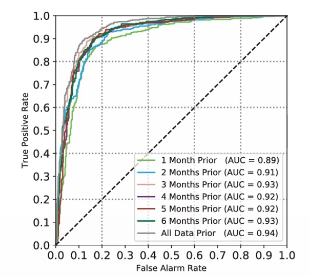

# Mental Disorder Detection from Social Media

## Introduction
The project focuses on detecting mental disorders using social media data. Social media footprints are pivotal as they reflect current behavior patterns, aiding in mental disorder inference. The significance lies in the potential to prevent mental health breakdowns leading to serious consequences.

## Data
### Domain Knowledge
- Essential for effective feature extraction.
  

### Symptoms of Depression
- Crucial in understanding and identifying depression markers.
  

### Pre-processing
- **Vectorization:** Converts text to numerical representations, analyzing sentiment direction. Uses LIWC for feature extraction.
  
  
- **Visualization:** Data exploration to understand behavior trends and data distribution.
- **Feature Extraction:** Includes word count and sentiment analysis of each word.
  

## Modeling
- Utilizes classical supervised machine learning (e.g., Logistic Regression).
- Framework includes LIWC for feature extraction.
  

## Evaluation
- Emphasizes the importance of feature selection in enhancing model performance.
  
- ROC analysis indicates high True Positive Rate (TPR) and low False Alarm Rate (FAR), improving with more data.
  
