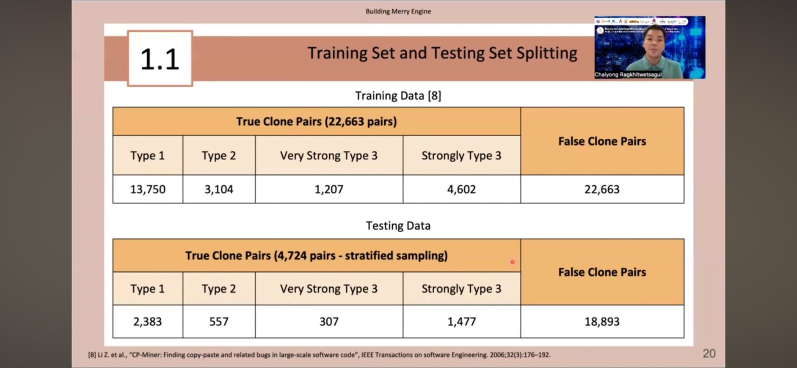
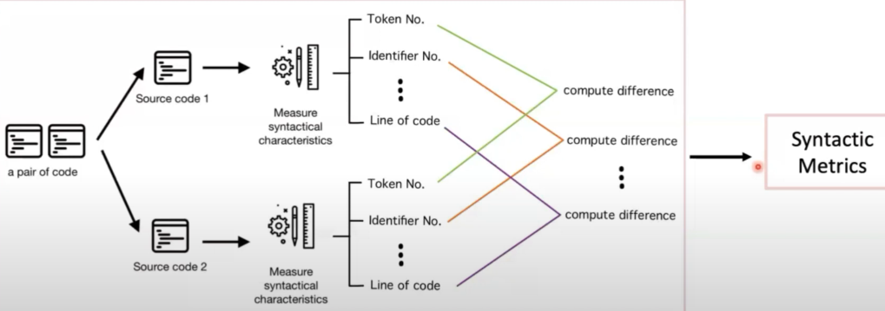
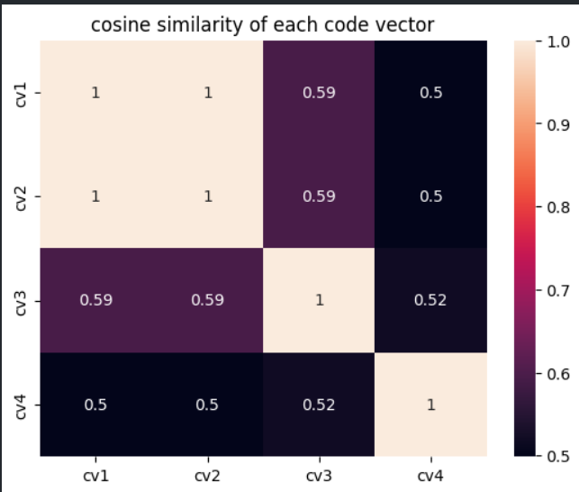

# Code Plagiarism Detection in Software Development

## Introduction
This project addresses the challenge of detecting code plagiarism in software development. It leverages pre-trained models like code2vec and codeBERT for feature extraction, focusing on reducing code redundancy and identifying similarities in code snippets.

## Case Study: Code Cloning Detection
- Data Source: Java language projects from the Big Clone Bench dataset, encompassing over 25,000 projects.
- Focus: Detecting cloning levels 1-3 (exact matches, variable name edits, and paraphrased statements).

### Data Split Ratio


### Process
- Preprocessing: Whitespace removal, vectorizing code, and matching.
- Code Matrix Extraction: Analyzing syntactic and algorithmic styles.
  
  

### Feature Extraction
- Example of extracted features for the machine learning model.
  

## Evaluation
- Model performance evaluated using precision and recall.
- User experience assessed through usability tests and comparisons with existing products.

## Implementation
- Process involves parsing GitHub code, extracting vectors and tokens, and applying the coding matrix.
  

## Workshop
- Example of a heatmap plot using seaborn for cosine similarity analysis.
  

### Code Snippets
- Cosine similarity calculation:
  ```python
  def cos_sim(A, B):
      return np.dot(A, B) / (norm(A) * norm(B))

  
 this is heatmap plot using seaborn library using this code that I customize by myself
 ```python
A = np.array(cv1, dtype=float)
B = np.array(cv2, dtype=float)
C = np.array(cv3, dtype=float)
D = np.array(cv4, dtype=float)
cv = [A,B,C,D]
sim = np.zeros(shape = (4,4))
for i in range(4):
  for j in range(4):
    sim[i][j] = cos_sim(cv[i],cv[j])

ax = sns.heatmap(sim, xticklabels = ["cv1","cv2","cv3","cv4"], yticklabels = ["cv1","cv2","cv3","cv4"], annot=True )
ax.set(title="cosine similarity of each code vector")
```
 for cosine similarlity it can be compute easily by this code

```python
def cos_sim(A, B):
  return np.dot(A,B)/(norm(A)*norm(B))
```
we calculate them this way because now each code is vector then alignment is equivalent to similarity of the code so we can use dot product to calculate the alignment and use it as similarity.
